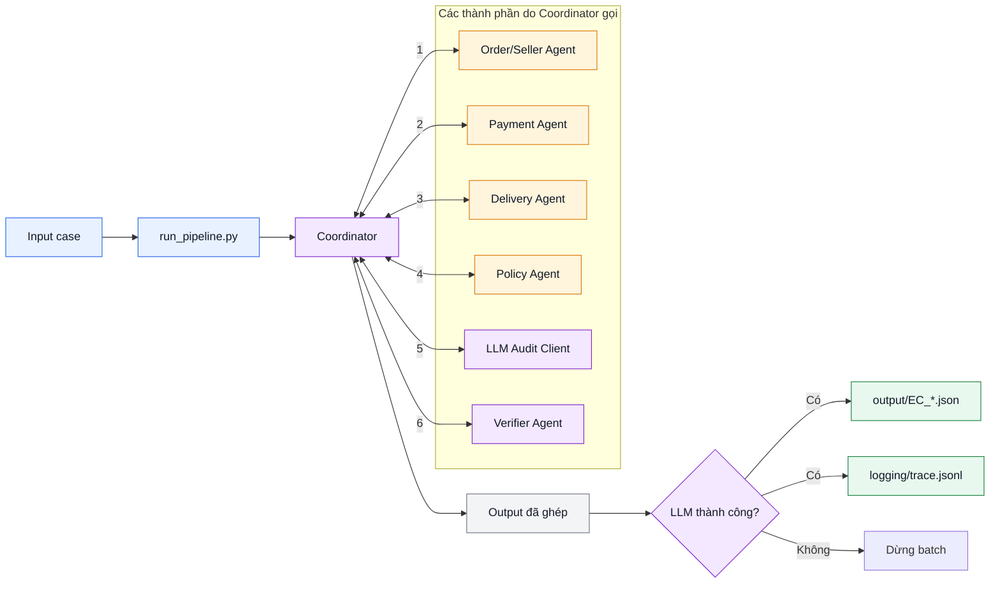
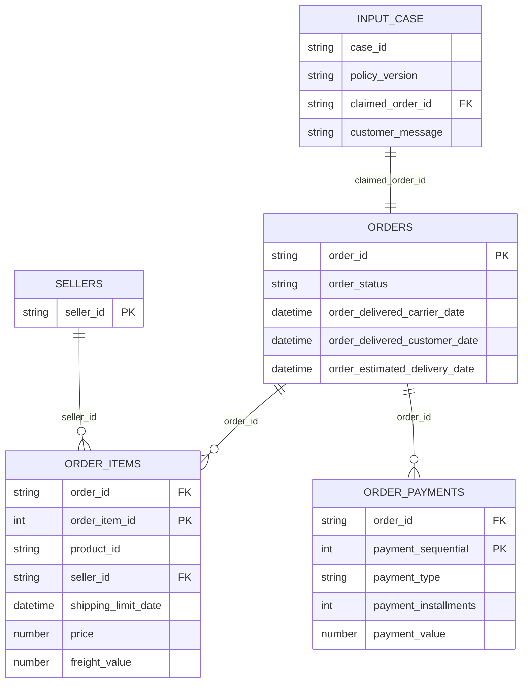
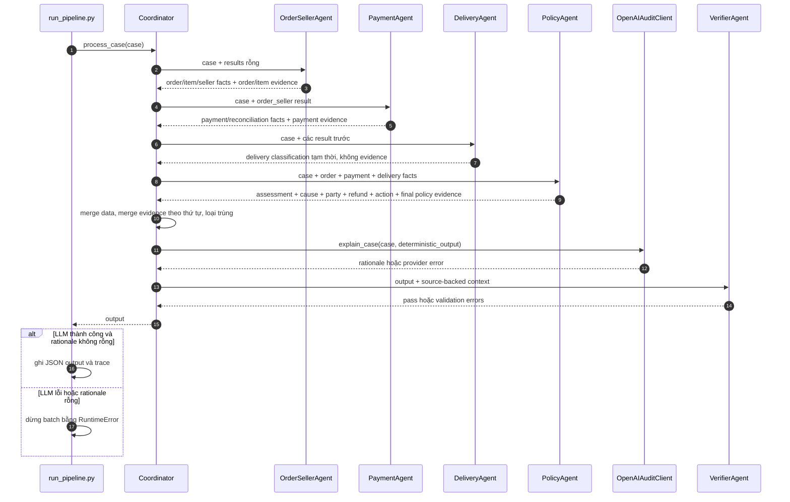
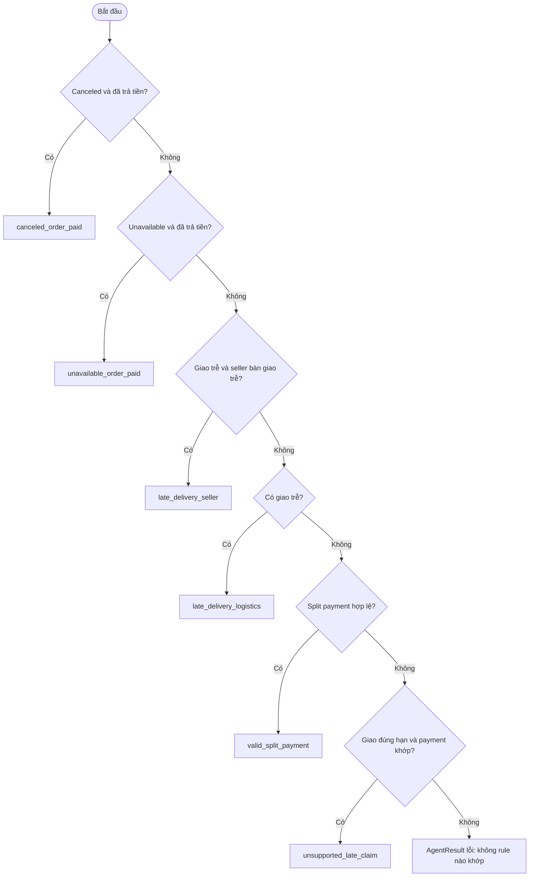

# Kiến trúc hệ thống Multi-Agent E-commerce Dispute Resolution

## 1. Mục tiêu và nguyên tắc thiết kế

Hệ thống đọc từng hồ sơ khiếu nại trong `input/`, đối chiếu dữ liệu Olist, áp dụng `EC_POLICY_V1` và tạo một JSON kết quả tương ứng trong `output/`.

Kiến trúc hiện tại có hai lớp xử lý tách biệt:

- **Lớp quyết định xác định (deterministic):** Order & Seller, Payment, Delivery và Policy Agent truy vấn dữ liệu hoặc áp dụng rule. Đây là lớp duy nhất quyết định vấn đề, nguyên nhân, bên chịu trách nhiệm, số tiền hoàn và hành động.
- **Lớp audit bằng LLM:** OpenAI chỉ diễn giải ngắn gọn kết quả đã được tính sẵn. Nội dung LLM được ghi vào trace và không được phép sửa output.

Coordinator chỉ điều phối, lưu handoff và ghép kết quả. Verifier chỉ kiểm tra, không tự sửa quyết định.

## 2. Sơ đồ tổng thể



Coordinator là trung tâm duy nhất điều khiển pipeline. Mũi tên hai chiều biểu diễn một lần Coordinator gọi thành phần và nhận kết quả trả về; số trên mũi tên là thứ tự gọi. **Các agent không gọi trực tiếp lẫn nhau.**

| Thành phần | Vai trò trong sơ đồ |
| --- | --- |
| Coordinator | Giữ context, gọi agent theo thứ tự và ghép kết quả |
| 1. Order/Seller | Tìm order, items, sellers, timestamp và tổng tiền hàng |
| 2. Payment | Cộng các payment rows và kiểm tra reconciliation |
| 3. Delivery | Xác định giao trễ và seller bàn giao trễ |
| 4. Policy | Chọn issue, root cause, party, refund và action cuối cùng |
| 5. LLM Audit | Viết rationale; không được sửa output deterministic |
| 6. Verifier | Kiểm tra schema, ID, tiền và tính nhất quán policy |

| Lần gọi | Coordinator gửi | Thành phần trả về Coordinator |
| --- | --- | --- |
| 1. Order/Seller | Case đầu vào | Order, item, seller, timestamp và các tổng tiền |
| 2. Payment | CaseContext có kết quả Order/Seller | Payment rows, payment total, reconciliation và payment IDs |
| 3. Delivery | CaseContext có các kết quả trước | Trạng thái giao trễ, đúng hạn và seller bàn giao trễ |
| 4. Policy | CaseContext có Order, Payment và Delivery facts | Issue, cause, party, refund, action và policy evidence |
| 5. LLM Audit | Case và output deterministic đã ghép | Rationale hoặc provider error; không sửa output |
| 6. Verifier | Case, toàn bộ results và output | Pass hoặc danh sách validation errors |

Thứ tự bốn domain agent là bắt buộc vì mỗi agent phía sau nhận context chứa kết quả của tất cả agent phía trước.

## 3. Quan hệ dữ liệu



Các khóa ghép được đưa ra output/evidence:

- Item ID: `<order_id>:<order_item_id>`
- Payment ID: `<order_id>:<payment_sequential>`
- Evidence ID: `order:*`, `item:*`, `payment:*`, `seller:*` hoặc `policy:*`

## 4. Vai trò, quyền truy cập và ownership

Các quyền dưới đây là quyền truy cập logic đang thể hiện trong code, không phải quyền hệ điều hành.

| Thành phần | Được đọc trực tiếp | Được đọc qua handoff | Được tạo hoặc ghi | Không được làm |
| --- | --- | --- | --- | --- |
| `scripts/run_pipeline.py` | `input/*.json`, cấu hình các class | Output trả về từ Coordinator | `output/*.json`, `logging/trace.jsonl` | Không áp dụng business rule |
| Coordinator | Case đầu vào và toàn bộ `AgentResult` | Kết quả của bốn domain agent | `CaseContext`, output đã ghép, trạng thái LLM | Không đọc CSV; không tự phân loại lỗi hoặc tính refund |
| Order & Seller Agent | `olist_orders_dataset.csv`, `olist_order_items_dataset.csv`, `olist_sellers_dataset.csv` | `case.customer_request.claimed_order_id` | Order/item/seller facts; evidence `order:*`, `item:*` | Không đọc payment; không quyết định policy/refund |
| Payment Agent | `olist_order_payments_dataset.csv` | `order_id`, `item_total_brl`, `freight_total_brl` | Payment facts; evidence `payment:*` | Không đọc lại order/item CSV; không quyết định policy |
| Delivery Agent | Không đọc CSV trực tiếp | Timestamp, item và seller facts từ Order & Seller Agent | Trạng thái giao trễ/đúng hạn và seller bàn giao trễ | Không phát evidence policy/seller; không chọn quyết định cuối cùng |
| Policy Agent | `rules.py` và `policy_version` | Facts từ Order & Seller, Payment và Delivery | Assessment, root cause, party, refund, action; evidence `policy:*` và seller liên quan | Không truy vấn CSV; không gọi LLM |
| OpenAI Audit Client | `OPENAI_API_KEY` từ môi trường hoặc `.env` | Customer message và output deterministic đã ghép | Rationale tiếng Việt trong trace | Không thay đổi assessment, evidence, party, tiền hoặc action |
| Verifier Agent | Bốn CSV để tạo tập ID hợp lệ | Output cuối từ Coordinator | Danh sách lỗi validation | Không sửa output hoặc business decision |

Lưu ý về `olist_sellers_dataset.csv`: `OrderDataStore` nạp file và có hàm `get_sellers()`, nhưng luồng quyết định hiện tại lấy `seller_id` trực tiếp từ order items. Verifier vẫn dùng cả seller IDs trong items và seller CSV để kiểm tra tính tồn tại.

## 5. Handoff contract

Contract chung nằm trong `src/shared/contracts.py`.

### 5.1. Context truyền vào agent

```json
{
  "case": {
    "case_id": "EC_001",
    "policy_version": "EC_POLICY_V1",
    "customer_request": {
      "claimed_order_id": "...",
      "message": "..."
    }
  },
  "results": {
    "order_seller": {
      "agent": "order_seller",
      "ok": true,
      "data": {},
      "errors": [],
      "evidence_ids": []
    }
  }
}
```

### 5.2. Envelope trả về

Mỗi agent phải trả một `AgentResult`:

```text
AgentResult(
    agent: str,
    ok: bool,
    data: dict,
    errors: list[str],
    evidence_ids: list[str]
)
```

Nếu một domain agent trả `ok=False`, Coordinator dừng ngay và trả error output gồm agent lỗi, thông báo lỗi và danh sách agent đã chạy. Các agent sau không được gọi.

## 6. Luồng handoff chi tiết



### 6.1. Order & Seller → Payment

Các facts quan trọng:

- `order_id`, `order_status`
- Ba timestamp giao hàng
- `items`, `seller_ids`
- `item_total_brl`, `freight_total_brl`
- `seller_handoff_violations`, `violating_seller_ids`

Payment Agent tìm một prior result có đủ `order_id`, `item_total_brl` và `freight_total_brl`. Agent cộng tất cả payment rows bằng `Decimal`, đối chiếu với tổng item + freight trong sai số `0.10 BRL`, và chỉ đưa tối đa 5 payment IDs vào affected entities/evidence.

### 6.2. Order & Seller → Delivery

Delivery Agent so sánh:

- `order_delivered_customer_date > order_estimated_delivery_date` để xác định giao trễ;
- `order_delivered_carrier_date > shipping_limit_date` cho từng item để xác định seller bàn giao trễ.

Kết quả `delivery_classification` và `root_cause_code` ở bước này chỉ là facts tạm thời. Delivery Agent cố ý không phát `policy:*` vì Policy Agent còn phải áp dụng precedence toàn cục.

### 6.3. Order + Payment + Delivery → Policy

Policy Agent chọn đúng một issue theo thứ tự ưu tiên:



Refund được tính như sau:

- `issue_full_refund` → bằng `payment_total_brl`;
- `refund_freight` → bằng `freight_total_brl`;
- Hai action còn lại → `0 BRL`.

## 7. Ownership của evidence

| Prefix | Agent sở hữu | Khi nào được phát |
| --- | --- | --- |
| `order:<order_id>` | Order & Seller | Khi tìm thấy order |
| `item:<order_id>:<item_id>` | Order & Seller | Cho item thuộc order đang xử lý |
| `payment:<order_id>:<sequence>` | Payment | Cho payment row của order, tối đa 5 ID |
| `seller:<seller_id>` | Policy | Chỉ khi issue cuối là `late_delivery_seller`, cho seller thực sự bị quy trách nhiệm |
| `policy:<cause_code>` | Policy | Chỉ cho root cause cuối cùng sau precedence |

Coordinator ghép evidence theo thứ tự agent chạy và loại trùng bằng cách giữ lần xuất hiện đầu tiên. Coordinator không tự sinh evidence. Verifier yêu cầu mỗi `policy:<cause_code>` khớp với một ranked cause và ngược lại.

Phân biệt hai khái niệm:

- `affected_entities.seller_ids` liệt kê seller liên quan tới order;
- `seller:*` evidence chỉ xuất hiện với seller bị quy trách nhiệm trong kết luận cuối.

Không được phát `seller:*` cho mọi seller của order vì điều đó biến thực thể liên quan thành bằng chứng quy trách nhiệm.

## 8. Ghép output và kiểm tra cuối

Coordinator chỉ giữ bảy trường submission:

```text
case_id
assessment
affected_entities
root_cause_analysis
evidence_ids
financial_resolution
resolution_actions
```

`affected_entities` được ghép từ facts đã handoff:

- một `order_id`;
- tối đa 5 item IDs;
- tối đa 5 seller IDs;
- tối đa 5 payment IDs.

Verifier kiểm tra:

- đủ schema, đúng kiểu dữ liệu, enum và giới hạn số phần tử;
- tiền hữu hạn, không âm, làm tròn hai chữ số và refund đúng action;
- evidence/affected IDs tồn tại trong CSV và thuộc đúng order;
- issue, cause, party, status và action nhất quán với nhau;
- policy evidence khớp ranked cause;
- không có ID trùng, rank liên tiếp và responsible seller nằm trong affected sellers.

Nếu verifier thất bại, Coordinator gắn `_verification_errors` để chẩn đoán; Verifier không thay đổi bất kỳ trường quyết định nào.

## 9. Ranh giới của LLM audit

`OpenAIAuditClient` gọi model `gpt-4o-mini` với `temperature=0` và chỉ nhận:

- `case_id` và customer message;
- `assessment`;
- `root_cause_analysis`;
- `financial_resolution`;
- `resolution_actions`;
- `evidence_ids`.

Rationale tối đa ba câu tiếng Việt được lưu trong `logging/trace.jsonl`, không nằm trong submission JSON. `scripts/run_pipeline.py` yêu cầu một lần gọi thật thành công cho mỗi case; nếu API lỗi hoặc trả rationale rỗng, batch dừng trước khi ghi case đó.

## 10. Ánh xạ mã nguồn

```text
src/
├── shared/
│   ├── contracts.py          # Agent, AgentResult, CaseContext, output keys
│   └── llm_client.py         # OpenAI audit, không ra quyết định
├── coordinator/
│   └── agent.py              # Điều phối, fail-fast, merge, audit, verify
├── order_seller/
│   ├── queries.py            # Đọc orders/items/sellers CSV
│   └── agent.py              # Order/item/seller facts
├── payment/
│   ├── queries.py            # Index payment rows theo order_id
│   └── agent.py              # Reconciliation bằng Decimal
├── delivery_policy/
│   ├── delivery_agent.py     # Delivery facts tạm thời
│   ├── policy_agent.py       # Quyết định EC_POLICY_V1 cuối cùng
│   └── rules.py              # Vocabulary, priority, tolerance, mapping rule
└── verifier/
    ├── agent.py              # Nạp tập ID nguồn và adapter Agent
    └── schema_validator.py   # Validation thuần, không I/O
```

Ranh giới module này giúp các thành viên sửa từng domain độc lập: thay đổi truy vấn nằm trong `queries.py`, thay đổi logic domain nằm trong agent tương ứng, thay đổi contract cần được review chung, và business rule không được đưa vào Coordinator hoặc LLM.
